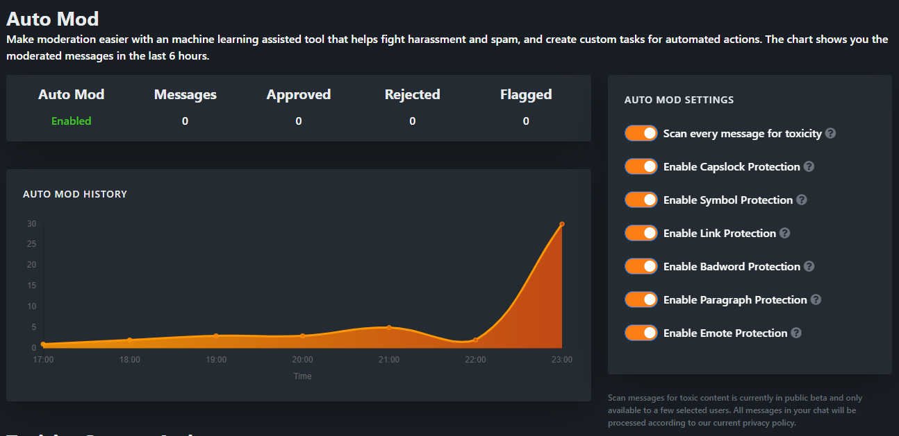

# Auto Mod

Make moderation easier with an machine learning assisted tool that helps fight harassment and spam, and create custom tasks for automated actions.

:::warning
With /mod OWN3D you can give our Chatbot all necessary rights. Read [here](README.md#why-our-chatbot-need-s-a-moderator-role) why we need Mod.
:::

## Scan every message for toxicity

The Auto Mod scores each message in your chat. Based on the score you can make automatic actions, for example banning the user in your chat if the score is over 70%. The higher the score is, the more toxic the message is.

:::warning
Scan messages for toxic content is currently in public beta and only available to a few selected users. All messages in your chat will be processed according to our current privacy policy.
:::

### Custom Actions

You can define a threshold for each custom action. If the message reaches the threshold, your action will be executed.

A threshold can be defined between 30-100 percent. The following actions are currently supported:

- Ban User
- Timeout User
- Delete Message
- Warn User

:::tip
Anything below 30% is likely to be Positive. Anything in between 30 - 70% is Neutral. Anything above 70% is likely to be Toxic.
:::

## Capslock Protection

The Capslock Protection filters your chat for excessive use of Capslock.

The exact amount of characters allowed nor prohibited is currently not disclosed.

## Symbol Protection

The Symbol Protection protects your chat from excessive, almost spam-like use of symbols (`.,!?§%$/[]`).

The exact amount of characters allowed nor prohibited is currently not disclosed.

## Link Protection

The Link Protection prohibits the use of links in your chat. In the current version **you can create a list of allowed links**. These links are not filtered unless there is another link in the same message that is not allowed.

:::warning
Please enter only the domain + TLD for the links. Speak `example.com` and **not** `https://example.com`. Otherwise you will only block `https` links from `example.com`.
:::

## Badword Protection

In the Badword Protection you can enter more words that were not recognized by the Toxicity Filter or simply should be removed from the chat.

## Paragraph Protection

The Paragprah Protection protects your chat from too long texts. So you don't have to read so much. Especially helpful for people who have trouble reading long texts in the chat.

Texts **longer than 200 characters** are automatically deleted by us.

## Emote Protection

Emote Protection prevents excessive use of Twitch Emotes (this currently does not include Unicode emotes).

Currently, no more than **three emotes** may be used.
