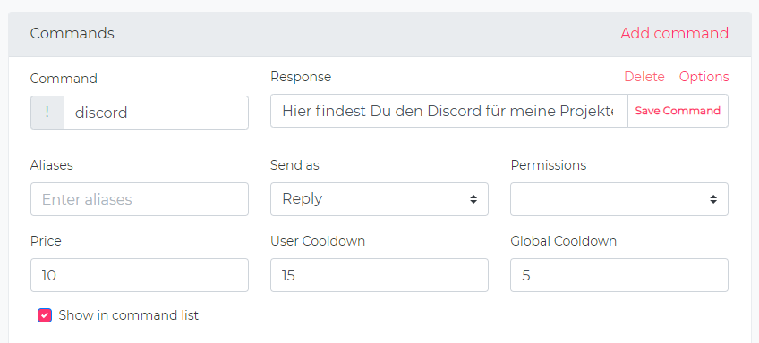

# Custom Commands

Custom commands allow you to create your own commands. The Custom Command system in OWN3D Pro is somewhat complex and can be used for some advanced stuff.

## Custom Commands



To create your first custom command, go to the OWN3D Pro Dashboard. There you click on Commands.
 
## Advanced Custom Commands

:::tip
Some basic coding knowledge with [Twig](https://twig.symfony.com/doc/2.x/) may be required to use some of these features. 
:::

## Using templates in custom commands

If you wish to do anything more than a "Type in a command" -> "Make the bot say something." Such as getting information on the person calling the command, and many others things. It is recommended that you check out this page:

### Synopsis

A template is a regular text file. It can generate any text-based irc messages.

A template contains **variables** or **expressions**, which get replaced with values when the template is evaluated, and **tags**, which control the template’s logic.

Below is a minimal template that illustrates a few basics. We will cover further details later on:

```twig


  You rolled your lucky 6 today!

  You rolled {{ number }}!

```

There are two kinds of delimiters: 

```text
 // this one is used to execute statements such as for-loops
```

and

```text
{{ ... }} // this one is used to outputs the result of an expression
```

### Variables

The chatbot passes variables to the templates for manipulation in the template. Variables may have attributes or elements you can access, too. The visual representation of a variable depends heavily on the chatbot providing it.

Use a dot (.) to access attributes of a variable.

```twig
{{ irc.channel }}
```

> It’s important to know that the curly braces are not part of the variable but the print statement. When accessing variables inside tags, don’t put the braces around them.

If a variable or attribute does not exist, you will receive a null value when the strict_variables option is set to false; alternatively, if strict_variables is set, Twig will throw an error (see environment options).

If you want to access a dynamic attribute of a variable, use the attribute function instead.

The attribute function is also useful when the attribute contains special characters (like - that would be interpreted as the minus operator):

```twig
{# equivalent to the non-working irc.tags.room-id #}
{{ attribute(irc.tags, 'room-id') }}
```

### Filters

Variables can be modified by filters. Filters are separated from the variable by a pipe symbol (|). Multiple filters can be chained. The output of one filter is applied to the next.

The following example title-cases the irc message:

```twig
{{ irc.message|title }}
```

### Control Structure

A control structure refers to all those things that control the flow of a program - conditionals (i.e. if/elseif/else), for-loops, as well as things like blocks. Control structures appear inside `` blocks.

In this example, we roll a dice:

```twig


  You rolled your lucky 6 today!

  You rolled {{ number }}!

```

## The Message template

:::tip
Checkout our [Template Reference](template-reference.md) for all `Command`, `IRC` message templates and our `Database`, `Cache`, `HTTP JSON Request` and many other functions.
:::

### Command

| Field                   | Type   | Description |
|-------------------------|--------|-------------|
| command.command         | string |             |
| command.commands        | array  |             |
| command.command_aliases | array  |             |
| command.response        | mixed  |             |
| command.command_regex   | string |             |
| command.permissions     | int    |             |
| command.price           | int    |             |
| command.send_as         | string |             |
| command.enable_when     | string |             |
| command.user_cooldown   | int    |             |
| command.global_cooldown | int    |             |
| command.is_visible      | bool   |             |

### IRC

| Field       | Type   | Description                  |
|-------------|--------|------------------------------|
| irc.tags    | mixed  | Twitch IRC user state object |
| irc.channel | string | Raw channel username         |
| irc.message | string | Raw message                  |

## Examples of custom commands

Here we offer the few examples to show what our template system can do:

### Fetch information from database

```twig
You currently have {{ db('membership').currency|default(0) }} Currency!
```

```twig
Your channel url is own3d.pro/{{ db('channel').slug }}
```

### Working with the cache & update database information

In this example, we allow the user to generate currency every 5 minutes.

```twig

  You're still on your cooldown period.

  {{ cache('timely', 1, 300) }}
  {{ inc('membership', 'curreny', 1)}}
  You collected $1!

```

### Creating json requests

The `json` method allows you to fetch data from another services. 
To learn more about this function, checkout [HTTP JSON Requests](template-reference.md#http-json-requests).

```twig
Random Quote: {{ json('GET', 'https://api.quotable.io/random').content }}
```

### Magic 8-Ball

This will create a simple `!8ball` command.

```twig

{{ random(answers) }}
```

### Lurk Messages

Twitch lurker is a term given to a passive viewer who is watching a stream but not contributing to the channel’s chat. People who are lurking in chat are often assumed to be bot traffic when in reality lurkers make up the vast majority of viewers on the platform.

Create a funny `!lurk` command:

```twig

{{ attribute(irc.tags, 'display-name') }}
{{ random(messages) }}
```

### Shoutout

Create a shoutout command `!so <username>`:

```twig


    Check out {{ channel.name }} over at {{ channel.url }}, they are playing {{ channel.game }}!

    Please define a valid user with "!so <username>".

```