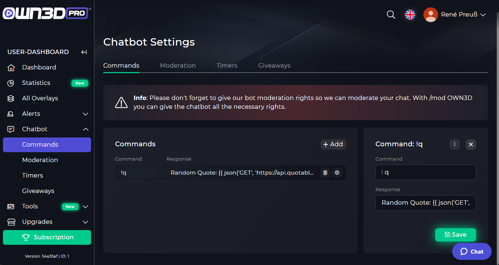

# Custom Commands

Custom commands allow you to create your own commands. The Custom Command system in StreamKit is somewhat complex and can be used for some advanced stuff.

## Custom Commands



To create your first custom command, go to the StreamKit Dashboard. There you click on Commands.
 
## Advanced Custom Commands

:::tip
Some basic coding knowledge may be required to use some of these features. 
:::

## Using templates in custom commands

If you wish to do anything more than a "Type in a command" -> "Make the bot say something. Such as assigning people roles, getting information on the person calling the command, and many others. It is recommended that you check out this page:

### Synopsis

A template is a regular text file. It can generate any text-based irc messages.

A template contains **variables** or **expressions**, which get replaced with values when the template is evaluated, and **tags**, which control the template’s logic.

Below is a minimal template that illustrates a few basics. We will cover further details later on:

```twig

  Your're still on your cooldown period.

  {{ cache('timely', 1, 300) }}
  {{ inc('membership', 'curreny', 1)}}
  You collected $1!

```

There are two kinds of delimiters: 

```text
 // this one is used to execute statements such as for-loops
```

and

```text
{{ ... }} // this one is used to outputs the result of an expression
```

### Variables

The chatbot passes variables to the templates for manipulation in the template. Variables may have attributes or elements you can access, too. The visual representation of a variable depends heavily on the chatbot providing it.

Use a dot (.) to access attributes of a variable.

```twig
{{ irc.channel }}
```

> It’s important to know that the curly braces are not part of the variable but the print statement. When accessing variables inside tags, don’t put the braces around them.

If a variable or attribute does not exist, you will receive a null value when the strict_variables option is set to false; alternatively, if strict_variables is set, Twig will throw an error (see environment options).

If you want to access a dynamic attribute of a variable, use the attribute function instead.

The attribute function is also useful when the attribute contains special characters (like - that would be interpreted as the minus operator):

```twig
{# equivalent to the non-working irc.tags.room-id #}
{{ attribute(irc.tags, 'room-id') }}
```

### Filters

Variables can be modified by filters. Filters are separated from the variable by a pipe symbol (|). Multiple filters can be chained. The output of one filter is applied to the next.

The following example title-cases the irc message:

```twig
{{ irc.message|title }}
```

### Control Structure

A control structure refers to all those things that control the flow of a program - conditionals (i.e. if/elseif/else), for-loops, as well as things like blocks. Control structures appear inside `` blocks.

In this example, we allow the user to generate currency every 5 minutes:

```twig

  Your're still on your cooldown period.

  {{ cache('timely', 1, 300) }}
  {{ inc('membership', 'curreny', 1)}}
  You collected $1!

```

## The Message template

:::tip
Checkout our [Template Reference](template-reference.md) for all `Command`, `IRC` message templates and our `Database`, `Cache`, `HTTP JSON Request` and many other functions.
:::

### Command

| Field                   | Type   | Description |
|-------------------------|--------|-------------|
| command.command         | string |             |
| command.commands        | array  |             |
| command.command_aliases | array  |             |
| command.response        | mixed  |             |
| command.command_regex   | string |             |
| command.permissions     | int    |             |
| command.price           | int    |             |
| command.send_as         | string |             |
| command.enable_when     | string |             |
| command.user_cooldown   | int    |             |
| command.global_cooldown | int    |             |
| command.is_visible      | bool   |             |

### IRC

| Field       | Type   | Description                  |
|-------------|--------|------------------------------|
| irc.tags    | mixed  | Twitch IRC user state object |
| irc.channel | string | Raw channel username         |
| irc.message | string | Raw message                  |

## Examples of custom commands

Here we offer the few examples to show what our template system can do:

### Fetch information from database

```twig
You currently have {{ db('membership').currency|default(0) }} Currency!
```

```twig
Your channel url is own3d.pro/{{ db('channel').slug }}
```

### Working with the cache & update database information

In this example, we allow the user to generate currency every 5 minutes.

```twig

  You're still on your cooldown period.

  {{ cache('timely', 1, 300) }}
  {{ inc('membership', 'curreny', 1)}}
  You collected $1!

```

### Creating json requests

```twig
Random Quote: {{ json('GET', 'https://api.quotable.io/random').content }}
```
