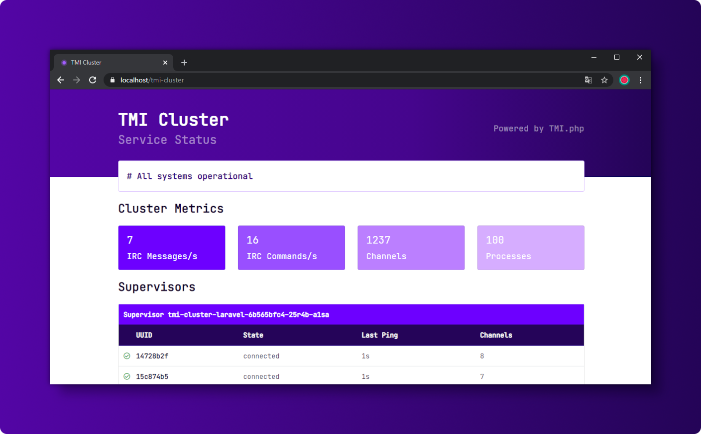

# TMI Cluster

[[toc]]

## Introduction

::: warning
This package is still in an early stage. Please do not put this software into production yet, as the APIs are subject to change. Everyone is welcome to contribute to this project.
:::



TMI Cluster is a Laravel package that smoothly enables a highly scalable IRC client cluster for Twitch. TMI Cluster consists of multiple supervisors that can be deployed on multiple hosts. The core is inspired by Horizon, which handles the complex IRC process management.

The cluster stores its data in the database and has a Redis Command Queue to send IRC commands and receive messages.

## Installation

You may use Composer to install TMI Cluster into your Laravel project:

```bash
composer require ghostzero/tmi-cluster
```

After installing TMI Cluster, publish its assets using the `tmi-cluster:install` and `migrate` Artisan command:

```bash
php artisan tmi-cluster:install

php artisan migrate
```

### Keeping TMI Cluster Assets Updated

In addition, when upgrading to any new TMI Cluster version, you should re-publish TMI Cluster's assets:

```bash
php artisan tmi-cluster:publish
```

To ensure TMI Cluster's assets are updated when a new version is downloaded, you may add a Composer hook inside your project's composer.json file to automatically publish TMI Cluster's latest assets:

```json
"scripts": {
    "post-update-cmd": [
        "@php artisan tmi-cluster:publish --ansi"
    ]
}
```

## Configuration

After publishing TMI Cluster's assets, its primary configuration file will be located at `config/tmi-cluster.php`. This configuration file allows you to configure your process options and each configuration option includes a description of its purpose, so be sure to thoroughly explore this file.

### Redis Connection

A Redis Cache is required for the TMI Cluster. The configuration is already pre-configured. If you have more than one TMI Cluster running on your Redis, then you should adjust the cluster prefix.

### TMI Client Configuration

::: tip
We ourselves use the TMI Cluster only with Verified Bot credentials. We do not recommend this cluster for normal accounts. We also have no experience with Known Bot accounts so far. 
::: 

### Auto Scaling

TMI Cluster comes directly with Auto-Scaling, since we initially developed this cluster for applications with over 10,000 joined channels. It will scale out by one instance if average channel usage is above 70%, and scale in by one instance if channel usage falls below 50%.

The flapping situation can be controlled by choosing an adequate margin between the scale-out and scale-in thresholds.

You can also limit the minimum and maximum processes.

```php
'auto_scale' => [
    'restore' => true,
    'processes' => [
        'min' => 2,
        'max' => 25
    ],
    'thresholds' => [
        'channels' => 50,
        'scale_in' => 50,
        'scale_out' => 70,
    ],
]
```

### Auto Cleanup

Normally you are responsible for your join/parts, because we want you to be in control. However, we have included an optional automatic cleanup. This must be activated manually.

Before you enable this function: This feature uses the [romanzipp/laravel-twitch](https://github.com/romanzipp/Laravel-Twitch) library, please configure your Laravel project. You can install it via the composer command:

```bash
composer require romanzipp/laravel-twitch:^3.0
```

Here is a sample configuration that performs a cleanup every 5 minutes. During the cleanup, all channels that are offline will be parted:

```php
'auto_cleanup' => [
    'enabled' => false,
    'interval' => 300,
    'max_delay' => 600,
],
```

## Running TMI Cluster

Once you have configured your TMI Cluster in the `config/tmi-cluster.php` configuration file, you may start the cluster by using the `tmi-cluster` Artisan command. This single command will start one singe supervisor with all of your configured processes:

```bash
php artisan tmi-cluster
```

You can also run this command multiple times to spawn multiple supervisors.

You may check the current status of your TMI Cluster by using the `tmi-cluster:list` Artisan command:

```bash
php artisan tmi-cluster:list
```

### Deploying TMI Cluster

If you are deploying TMI Cluster to a live server, you should configure a process monitor to monitor the `php artisan tmi-cluster` command and restart it if it quits unexpectedly. When deploying fresh code to your server, you will need to instruct the master TMI Cluster process to terminate so it can be restarted by your process monitor and receive your code changes.

#### Installing Supervisor

Supervisor is a process monitor for the Linux operating system, and will automatically restart your `tmi-cluster` process if it fails. To install Supervisor on Ubuntu, you may use the following command:

```bash
sudo apt-get install supervisor
```

#### Supervisor Configuration

Supervisor configuration files are typically stored in the `/etc/supervisor/conf.d` directory. Within this directory, you may create any number of configuration files that instruct supervisor how your processes should be monitored. For example, let's create a `tmi-cluster.conf` file that starts and monitors a `tmi-cluster` process:

```text
[program:tmi-cluster]
process_name=%(program_name)s
command=php /home/ghostzero/tmi-app/artisan tmi-cluster
autostart=true
autorestart=true
user=ghostzero
redirect_stderr=true
stdout_logfile=/home/ghostzero/tmi-app/tmi-cluster.log
stopwaitsecs=3600
```

#### Starting Supervisor

Once the configuration file has been created, you may update the Supervisor configuration and start the processes using the following commands:

```bash
sudo supervisorctl reread

sudo supervisorctl update

sudo supervisorctl start tmi-cluster
```

For more information on Supervisor, consult the [Supervisor documentation](http://supervisord.org/index.html).

## Events

### Handle IRC Messages

To handle irc messages like, chat messages and commands, you need to register a event subscriber into your Laravel application. Event subscribers are classes that may subscribe to multiple events from within the class itself, allowing you to define several event handlers within a single class. The TMI Cluster emits all [TMI events](events.md).

```php
<?php

namespace App\Listeners;

use GhostZero\Tmi\Events\Twitch\CheerEvent;
use GhostZero\Tmi\Events\Twitch\MessageEvent;
use GhostZero\Tmi\Events\Twitch\SubEvent;

class TmiEventSubscriber
{
    public function handleMessageEvent(MessageEvent $event): void
    {
        // handle your message event
    }

    public function handleCheerEvent(CheerEvent $event): void
    {
        // handle your cheer event
    }

    public function handleSubEvent(SubEvent $event): void
    {
        // handle your sub event
    }

    /**
     * Register the listeners for the subscriber.
     *
     * @return array
     */
    public function subscribe(): array
    {
        return [
            MessageEvent::class => [
                [__CLASS__, 'handleMessageEvent']
            ],
            CheerEvent::class => [
                [__CLASS__, 'handleMessageEvent']
            ],
            SubEvent::class => [
                [__CLASS__, 'handleMessageEvent']
            ],
        ];
    }
}
```

After writing the subscriber, you are ready to register it with the event dispatcher. You may register subscribers using the `$subscribe` property on the `EventServiceProvider`. For example, let's add the `TmiEventSubscriber` to the list:

```php
<?php

namespace App\Providers;

use Illuminate\Foundation\Support\Providers\EventServiceProvider as ServiceProvider;

class EventServiceProvider extends ServiceProvider
{
    /**
     * The event listener mappings for the application.
     *
     * @var array
     */
    protected $listen = [
        //
    ];

    /**
     * The subscriber classes to register.
     *
     * @var array
     */
    protected $subscribe = [
        'App\Listeners\TmiEventSubscriber',
    ];
}
```

### List of all TMI Cluster

You will find all TMI Cluster Events within the `GhostZero\TmiCluster\Events` namespace:

- `ClusterClientRegistered`
- `ClusterClientTerminated`
- `IrcCommandEvent`
- `IrcMessageEvent`
- `PeriodicTimerCalled`
- `SupervisorLooped`
- `UnableToLaunchProcess`
- `WorkerProcessRestarting`

## Notifications

Notifications are planned in the next major version of the TMI Cluster. It will send messages, if for example complete instances have failed and have been cleaned up by the purge command.
